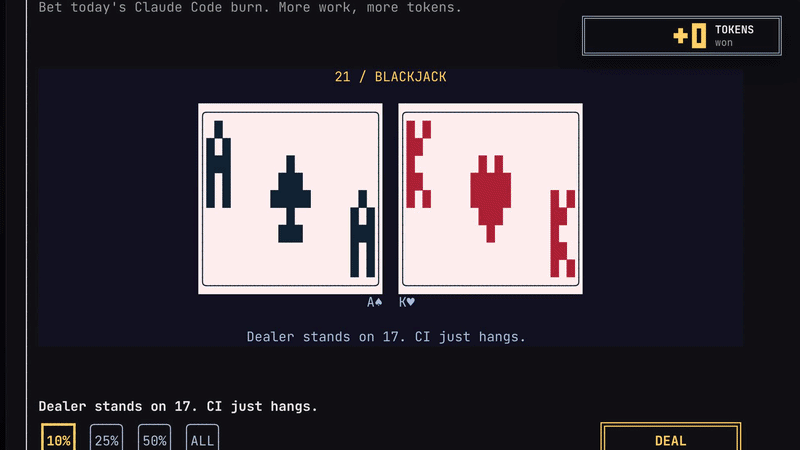

<h1 align="center">gamble with claude code</h1>

<p align="center"><i>you're absolutely right! ставлю всё.</i></p>

<p align="center"><a href="README.md">[🇬🇧 →]</a> · <a href="README.zh.md">[🇨🇳 →]</a> </p>

<p align="center"></p>

казино прямо внутри Claude Code. слоты, рулетка и блэкджек — а ставишь ты токены, которые Claude Code реально сжёг за сегодня.

<h2 align="center">о чём это?</h2>

ты всё равно сжигаешь миллионы токенов в день. так хоть погемблить на них.

- каждый токен, который Claude Code сжёг с полуночи, — токен в твоём кошельке.
- всё проиграл? иди работай. кошелёк пополняется с каждым промптом.
- в полночь кошелёк сгорает. как контекстное окно, только раз в сутки.

никаких настоящих денег. ничего не купить и не вывести. никогда. это шутка про гемблинг, а не гемблинг.

<h2 align="center">установка</h2>

```
/plugin marketplace add szarkans/gamble-with-claude-code
/plugin install gamble-with-claude-code@gamble-with-claude-code
```
или
```
claude plugin marketplace add szarkans/gamble-with-claude-code
claude plugin install gamble-with-claude-code@gamble-with-claude-code
```

потом `/reload-plugins` (или перезапусти Claude Code) и

```
/casino
```

нужно: Claude Code 2.1.287+ (тот, где появились моды) и `python3` — он считает сегодняшние токены, только стандартная библиотека. работает в терминале; в `claude -p` и в чате VS Code моды не рисуются.
терминал нужен высотой строк в 50, иначе панель листается PageDown.

хочешь новые игры без лишних движений? `/plugin` → Marketplaces → gamble-with-claude-code → **Enable auto-update**.

<h2 align="center">игры</h2>

**слоты** — три барабана, 777 платит ×20, `rm -rf` ×3 платит ×50. не спрашивай.

**рулетка** — европейская, 0–36. красное/чёрное, чёт/нечет, половины, дюжины или одно число на 35:1.

**блэкджек** — дилер стоит на 17, блэкджек платит 3:2, есть дабл. сплита нет. пока.

<h2 align="center">управление</h2>

`z` `x` `c` — слоты, рулетка, блэкджек  
`1`–`4` — ставка 10%, 25%, 50%, всё  
`s` — крутить / раздать / хватит  
`h` — ещё карту, `d` — дабл  
`esc` или `q` — обратно работать

мышь тоже работает — там, где терминал сообщает о кликах.

<h2 align="center">как считаются токены?</h2>

по собственным логам сессий Claude Code на твоей машине (`~/.claude/projects` или `$CLAUDE_CONFIG_DIR`). сегодняшние вход + запись в кэш + выход. чтение из кэша не считается — перечитать тот же контекст не работа.

ничего не уходит с твоей машины. мод не делает ни одного сетевого запроса.

<h2 align="center">ещё</h2>

- звук играет только на macOS. это Claude Code, не мы.
- `GWCC_DEBUG=1 claude` — отдельный фейковый кошелёк и кнопки, которые выдают джекпот. для скриншотов. мы тебя знаем.
- дальше: **gamble-with-ai** — то же казино в браузере, для любых агентов.

не связано с Anthropic. просто фанат с токеновой зависимостью.

<h2 align="center">почему README такой?</h2>

потому что его написал человек. *в основном*.  
гемблинг — это плохо. как и `--dangerously-skip-permissions`. ты всё равно делаешь и то, и другое.
